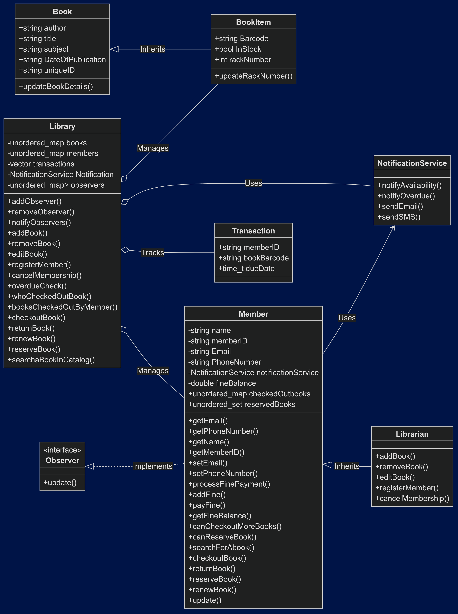

# 📚 Library Management System (C++)

## A comprehensive and extensible Library Management System built in C++, following object-oriented principles. This system allows librarians and members to manage book inventories, track checkouts and returns, and receive notifications for availability and due dates.

🧩 Features
🏛 Library Control: Add, remove, edit books, manage memberships.

🔐 User Roles:

Librarians: Full control over inventory and membership.

Members: Can borrow, reserve, and renew books.

📦 Book Items: Manage book metadata and physical copies.

🔁 Transactions: Checkout, return, renew tracking with due dates.

🔔 Notification System: Email or SMS alerts for due dates, availability.

👁 Observer Pattern: Notify users of changes in availability.

🧱 System Design
Object-Oriented Design using UML.

Inheritance: BookItem inherits from Book, Librarian from Member.

Observer Pattern: Implemented for notifying members.

Encapsulation: Clear API for Library, Member, Transaction.

Core Classes:
Library

Book, BookItem

Member, Librarian

Transaction

NotificationService

Observer (interface)

🚀 Getting Started
Prerequisites
C++17 compatible compiler (e.g. g++)

CMake (optional for build automation)

Compile

g++ -std=c++17 -o library_system main.cpp

./library_system

## 📂 LibrarySystem
    ├── 📄 main.cpp
    ├── 📄 Book.h / Book.cpp
    ├── 📄 Member.h / Member.cpp
    ├── 📄 Library.h / Library.cpp
    ├── 📄 Transaction.h / Transaction.cpp
    ├── 📄 NotificationService.h / .cpp
    ├── 📄 Observer.h
    ├── 📄 UML_Diagram.png
    └── 📄 README.md
📌 Future Improvements
GUI interface (Qt or ImGui)

Database integration (SQLite or MySQL)

User authentication

Logging and analytics

## UML design for the whole application

  

